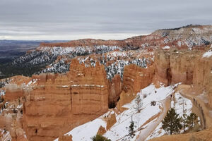

+++
title = '文章 3'
date = 2023-03-15T11:00:00-07:00
draft = false
tags = ['red','green','blue']
+++

最近去了一趟布莱斯峡谷国家公园，那里的自然风光让我震撼不已。站在观景台上，看着眼前壮观的石柱群，感受到了大自然的鬼斧神工。

旅行的意义不仅在于看风景，更在于内心的感悟。每一次出行都让我重新审视生活，找到前进的动力。

这次旅行让我明白，生活中需要偶尔停下脚步，去看看这个美丽的世界。只有这样，我们才能更好地珍惜所拥有的一切。
